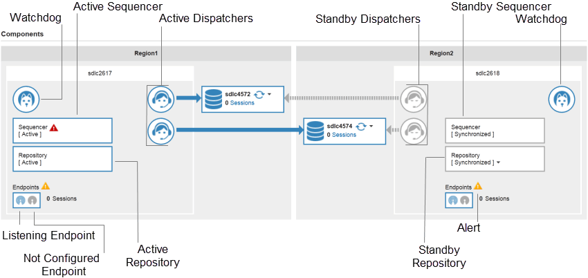
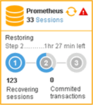

# Components Pane

The **Components** pane shows the configuration of a Teradata system managed by Unity. The layout of the components shows whether there is a single or dual-system configuration. A dual-system configuration is a high availability (HA) system with fail-over capability to a Standby system. You can change the state of components in your ecosystem.

The Components pane shows two regions for HA systems. Each region shows the number of sessions, type of processes installed, name of the processes, state of processes, and any alerts. For example, Region 1 shows an Active Sequencer with an alert.

If a Recovery is in process, the status appears in the Components pane. The Recovery process includes three steps. This example shows the second step.

