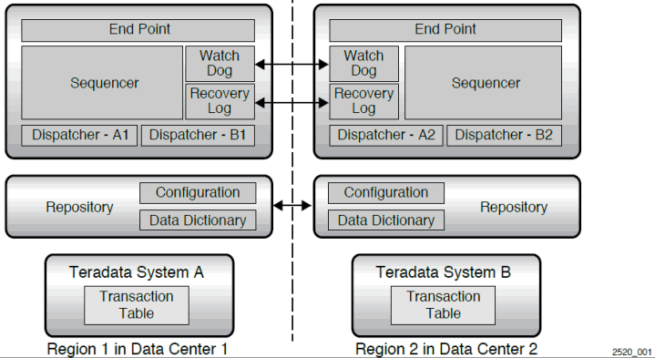

# Process Overview

When Unity is configured with two Teradata systems, each of the two regions have the following processes:

-   Endpoint
-   Sequencer
-   Watchdog
-   Recovery log
-   Two dispatchers

Each Unity system also has a Unity repository with configuration settings and a data dictionary.

Each Teradata system has a transaction table that is created as part of system activation.

Each process is assigned a region. To provide high availability, each region may contain failover copies of processes from other regions.

